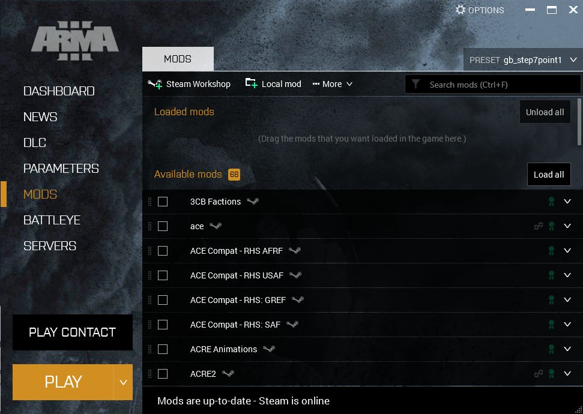
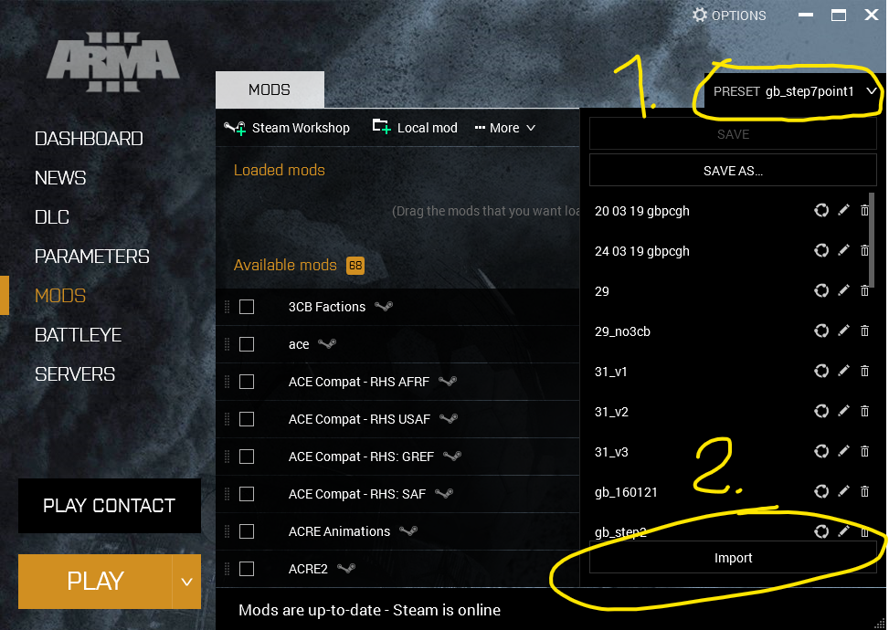

# Installing the game

This is a guide for setting up Arma 3.

### What you'll need

- [Arma 3](https://store.steampowered.com/app/107410/Arma_3/)
  - Frequently on sale for about [7€](https://isthereanydeal.com/game/armaiii/history/)
  - DLC is optional, but recommended. Specifically [Apex](https://store.steampowered.com/app/395180/Arma_3_Apex/) and [Contact](https://store.steampowered.com/app/1021790/Arma_3_Contact/), as they come with (good) maps and [Laws of War](https://store.steampowered.com/app/571710/Arma_3_Laws_of_War/) and [Marksmen](https://store.steampowered.com/app/332350/Arma_3_Marksmen/) since they're the most frequent causes of DLC Overlay Syndrome[^1].
- [Teamspeak >3.0](https://teamspeak.com/en/downloads/)
- [Latest GBPCGH Arma 3 mod preset](./files/gb_step7point1.html)

[^1]: DLC Overlay Syndrome - a kind of mental illness caused by using equipment from DLC that you don't own. Causes visual hallucinations (periodic overlay on screen and popups).
## Instructions

### First launch

Make sure you **don't have Teamspeak running** and start the game. You are greeted by the Arma 3 launcher.

Navigate to the **Mods** tab on the right. It should look like this (minus the available mods at the bottom).

Find your **preset .html file** and either drag and drop it into the launcher or click the **PRESET** button at the top right and click **Import** at the bottom, locate your preset file and import it.

This should cause your modlist to populate with mods and start a Steam Workshop content download. Wait for this download to finish and then verify that none of the mods in the list have a Corrupted or Dependency missing flag next to them. Also verify that the number of mods matches that of the preset **(As of preset gb_step7point1, 66)**. 

Once this is done, **ensure that Teamspeak 3** is closed and launch the game. You should get a popup about ACRE2 successfully copying it's plugin file to your Teamspeak 3 directory. **If this does not occur, ACRE2 will not work**.