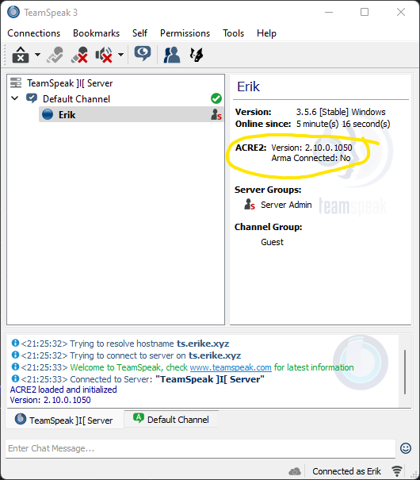
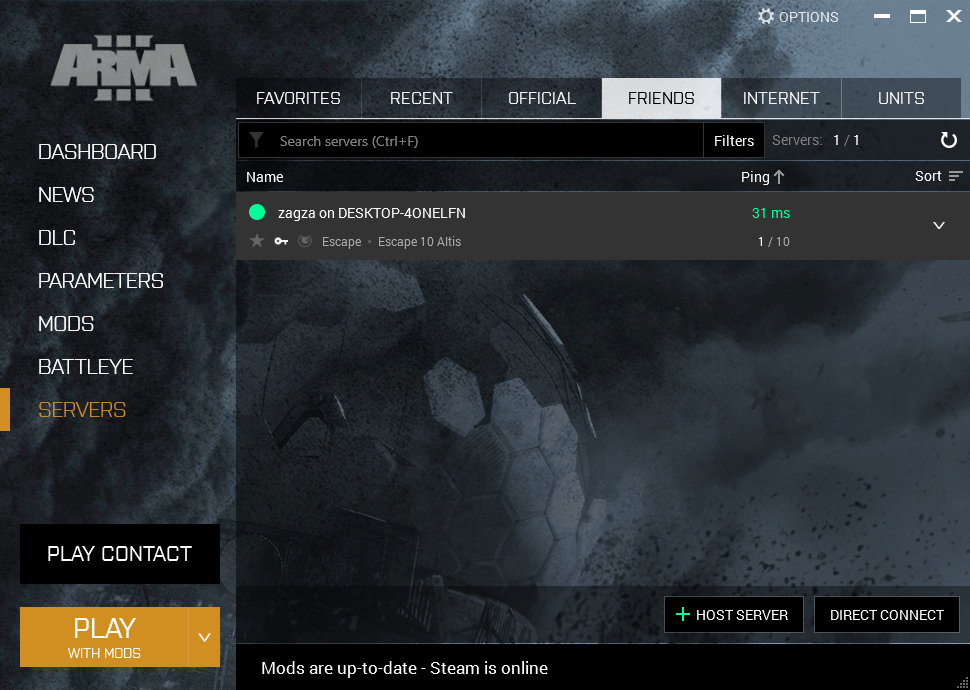
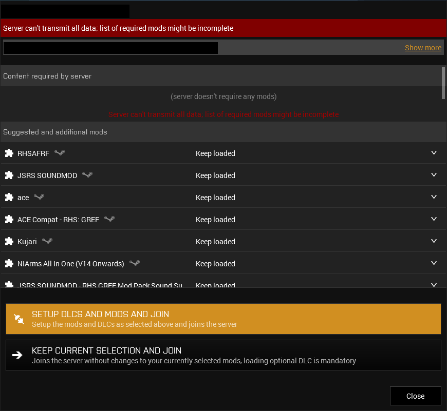
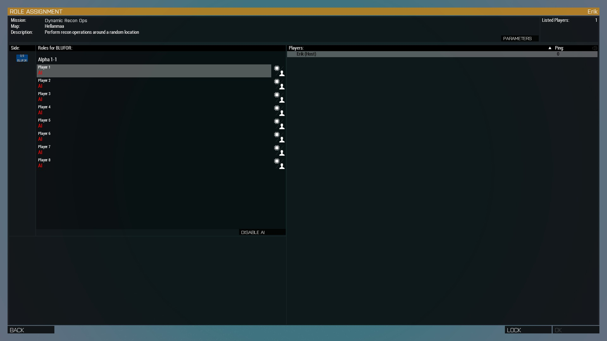

# Joining the server

So you've managed to install the game, the mods, the ACRE2 plugin for Teamspeak and are ready to walk for 2 hours, get mowed down by a BTR, respawn and repeat the process?

## Joining Teamspeak

Don't get ahead of yourself. First, join the Teamspeak server. The teamspeak server is located at ts.erike.xyz. If you don't know the password, it's the one we always use. If you don't know what that is, ask in the Discord.

When you join, click on your own name and take note of the information in the right, specifically the row that says ACRE2.

The two lines present in the screenshot should be present for you, specific version number is irrelevant. If they are not, close Teamspeak and restart Arma 3. If that doesn't solve the issue, navigate to *Arma install dir*/!Workshop/@ACRE2/plugin/ and copy the files within to *System drive letter:*/Users/*your username*/AppData/Roaming/TS3Client/plugins/

If these lines are present, proceed to the next step

## Joining the ArmA server

Start the launcher, click on servers and navigate to the friends tab. You should see the server appear on the list. Click on it and click join.

You should be presented with the dialog pictured below. Click the unhighlighted **Keep current selection and join** button. Ignore any popups about missing files or whatnot, unless it's to do with ACRE2. The game should launch and you should be presented with a lobby screen.

Congrats, you've correctly configured your game and successfully joined the server!

